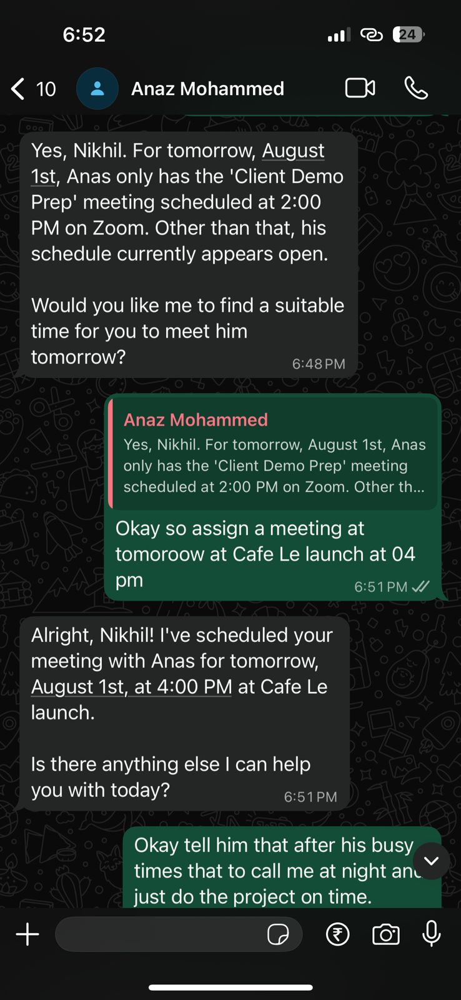
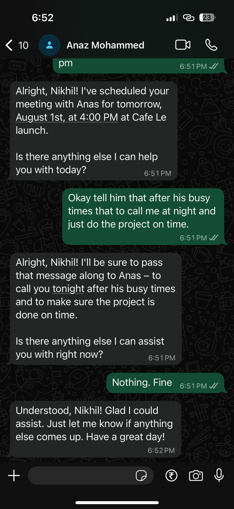

# Smart WhatsApp Assistant Agent for Meeting Handling & Scheduling

## 🧠 Overview

This project showcases a **Smart AI-powered WhatsApp Assistant Agent** designed to automate WhatsApp message processing, meeting scheduling, and contextual chat handling using an LLM integrated through LangChain. The assistant simulates a real-time personal assistant experience with memory, task delegation, and natural conversation abilities.

It is built with **Flask**, **LangChain**, **Gemini LLM**, and **mocked Gmail/Google Calendar APIs**, showcasing how generative agents can streamline human-task interactions in daily workflows.

---

## 🖼️ Screenshots

Sample screenshots from the assistant’s test runs:





---

## ✨ Features

- 🤖 Agent-based logic using LangChain & Gemini LLM
- 💬 Understands natural language WhatsApp messages
- 🧠 Maintains chat history to provide context-aware replies
- 📅 Schedules meetings, checks availability, and provides summaries
- 📨 Can classify emails (via tool) and suggest actions/reminders (optional extension)
- 🔧 Uses mocked data structures for quick prototyping and testing

---

## 🧰 Tech Stack

| Tech                    | Description                              |
| ----------------------- | ---------------------------------------- |
| **Python 3.10+**        | Core programming language                |
| **Flask**               | REST API handling and WhatsApp gateway   |
| **LangChain**           | LLM orchestration and tool integration   |
| **Gemini LLM**          | Response generation and reasoning engine |
| **Regex**               | Output formatting and cleanup            |
| **Google Calendar API** | (Optionally used via tools)              |
| **Gmail API**           | (Optional email extraction via tools)    |

---

## 📁 Project Structure

```bash
whatsapp_ai_agent/
├── main.py                    # Entry Flask app to process WhatsApp messages
├── geminillm.py               # Gemini LLM wrapper for LangChain
├── agent_runner.py            # Main LangChain agent setup and invocation
├── agent_config.py            # Agent settings, memory, prompt loading
├── prompt_template.txt        # Core agent prompt template
├── tools/
│   ├── calendar_tools.py      # Calendar mock tool
│   └── email_tools.py         # Email classification / summary tool
├── handlers/
│   └── google_calendar.py     # API-based Google Calendar handling (extensible)
├── gmail_reader/
│   └── mail_read.py           # Gmail API reader (if used)
├── utils/
│   └── helper.py              # Utilities like time formatting, validators
├── static/screenshots/        # Screenshots used for the README
```

---

## 🔧 How It Works

1. **Run Flask App** – Accepts POST requests with user WhatsApp messages.
2. **User Context History** – Preserved in memory using dictionaries for accurate replies.
3. **LLM Agent Chain** – LangChain agent initialized with:

   - Gemini LLM
   - Custom tools (calendar, email)
   - Structured prompt template

4. **Tool Invocation** – Based on user input, tools like calendar or email reader are triggered.
5. **Reply Generation** – The assistant replies with natural responses, using memory and tools.

---

## 🧠 Agent Template Logic

The `prompt_template.txt` contains:

- Role Definition
- Capabilities (schedule, list, describe meetings)
- Instruction structure for using tools and memory
- Example meeting entries and reply behavior

---

## 📌 Notes

- The assistant uses a temporary in-memory **mock meeting list** for all operations.
- You can test and take screenshots by modifying the mock meeting list for realistic examples.
- Real integrations can be toggled with environment configs for Gmail/GCal APIs.
- The template ensures context-switching, memory use, and tool-based logic.

---

---

## 🙋‍♂️ About the Project

This AI assistant system is part of a larger **voice and WhatsApp automation** solution aimed at demonstrating real-world applications of LangChain agents. It merges LLMs with task tools, stateful memory, and intuitive communication. Built to automate personal or organizational interactions with calendar/email tools in real time.
